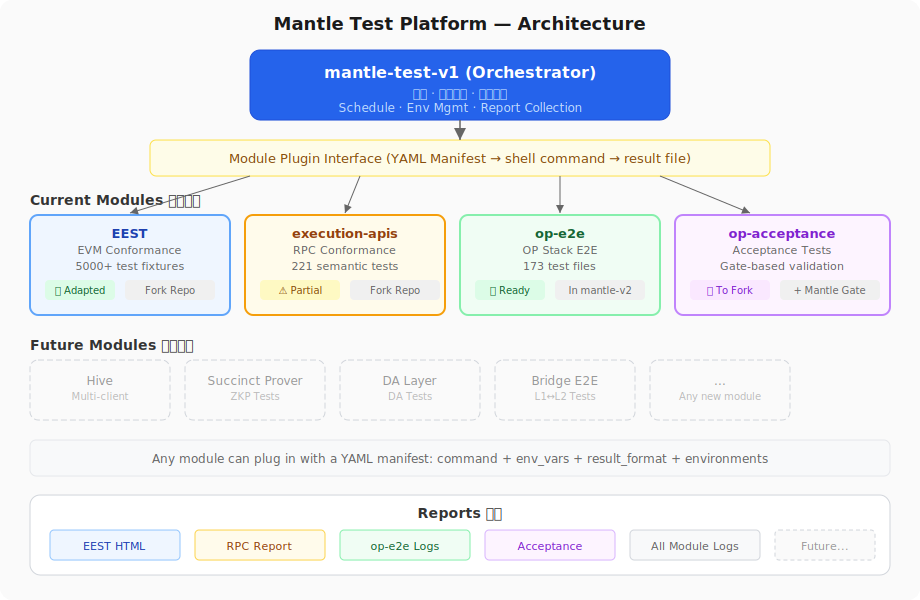

# Mantle Test

Generic test orchestration platform for Mantle chain-level behavioral verification.

通用测试编排平台，用于 Mantle 链级别的行为验证。

## Architecture 架构



The orchestrator **does not implement any test logic**. Each module is an independent repo with its own tests, CI, and reports. The orchestrator only invokes and collects.

编排器**不实现任何测试逻辑**。每个模块是独立仓库，有自己的测试、CI 和报告。编排器只负责调用、收集、比对。

## Current Modules 当前模块

| Module | Repo | What it tests | Status |
|--------|------|--------------|--------|
| **EEST** | mantle-execution-specs (fork) | EVM conformance: opcode, precompile, EIP | ✅ Adapted |
| **execution-apis** | mantle-execution-apis (fork) | RPC method conformance | ⚠️ Partial |
| **op-e2e** | mantle-v2/op-e2e | OP Stack e2e: deposit, withdraw, sequencer, fault proof | ✅ Ready |
| **op-acceptance** | mantle-v2 | Acceptance: operator fee, gas oracle, DA footprint | ✅ Ready |

New modules can plug in by adding a YAML manifest to `orchestrator/modules/` — no code changes needed.

新模块只需在 `orchestrator/modules/` 添加一个 YAML manifest 即可接入，无需修改代码。

## Quick Start

```bash
# Build
cd orchestrator && go build -o bin/mantle-test ./cmd/mantle-test/

# View execution plan
./bin/mantle-test plan --config=configs/localchain.yaml

# Run all modules
./bin/mantle-test run --config=configs/localchain.yaml

# Run specific module
./bin/mantle-test run --config=configs/qa.yaml --modules=eest
```

## Test Reports 测试报告

Reports: `https://mantlenetworkio.github.io/mantle-test-v1/`

Structure: `reports/<module>/<timestamp>.html`

```bash
# 1. Manual 手动上传
./orchestrator/scripts/upload-report.sh eest ./report_execute.html
git add reports/ && git commit -m "Add eest report" && git push

# 2. CI auto-push: module CI pushes to reports/ directly (see docs/usage.md §9.3)
# 3. workflow_dispatch: module CI uploads artifact + triggers collection (see docs/usage.md §9.4)
```

| Module | Report source |
|--------|--------------|
| eest | `mantle-execution-specs/execution_results/report_execute.html` |
| execution-apis | `make test` output |
| op-e2e | `go test` output |
| op-acceptance | `mantle-v2/op-acceptance-tests/logs/testrun-*/results.html` |

## Module Manifest Format

```yaml
name: my-module
description: What this module tests
repo: repository-name

suites:
  - name: suite-name
    phase: unit | integration | e2e | acceptance
    environments: [localchain, qa, mainnet]
    command: "shell command to execute"
    env_vars: [L2_RPC_URL, L2_CHAIN_ID, ...]
    result_format: gotest-json | junit-xml | eest-json
    timeout: 30m
```

## Project Structure

```
mantle-test-v1/
├── orchestrator/
│   ├── cmd/mantle-test/       # CLI: run, plan
│   ├── pkg/                   # Core packages
│   ├── modules/               # Module manifests
│   │   ├── eest.yaml          # EVM conformance (EEST)
│   │   ├── execution-apis.yaml # RPC conformance
│   │   ├── op-e2e.yaml        # OP Stack e2e
│   │   └── op-acceptance.yaml # Acceptance tests
│   ├── configs/               # Environment configs
│   └── scripts/               # upload-report.sh, collect-reports.sh
├── docs/                      # Documentation
│   ├── images/test-platform.svg
│   ├── architecture.md (EN) / architecture_zh.md (中文)
│   ├── test-strategy.md
│   ├── module-compatibility.md
│   ├── l2-adaptations.md
│   └── usage.md
├── reports/                   # Collected reports (gitignore)
└── .github/workflows/test.yml # CI
```

## Related Repositories 相关仓库

| Repo | Path | Purpose |
|------|------|---------|
| mantle-execution-specs | `/Users/user/space/mantle-execution-specs/` | EVM test cases + framework (fork of ethereum/execution-specs) |
| mantle-execution-apis | `/Users/user/space/mantle-execution-apis/` | RPC spec + test tools (fork of ethereum/execution-apis) |
| mantle-v2 | `/Users/user/space/mantle-v2/` | op-e2e + op-acceptance (already adapted) |

## Documentation 文档

- Architecture: [English](docs/architecture.md) | [中文](docs/architecture_zh.md)
- [Test Strategy](docs/test-strategy.md) — 4-layer test system
- [Module Compatibility](docs/module-compatibility.md) — Each module's Mantle compatibility
- [L2 Adaptations](docs/l2-adaptations.md) — EEST adaptation for Mantle L2
- [Migration Plan](docs/migration-plan.md) — chainregression 迁移计划（每个文件的迁移目标 + 执行计划）
- [Automation Design](docs/automation-design.md) — 自动化：代码变更触发测试、失败阻断合并、报告推送 Lark
- [Industry Comparison](docs/industry-comparison.md) — OP Stack 公链测试实践对比（Optimism / Base / Mantle）
- [FAQ](docs/faq.md) — 常见问题：EEST/execution-apis/适配/Hive/迁移
- [Usage Guide](docs/usage.md) — How to run, modify tests, CI setup
