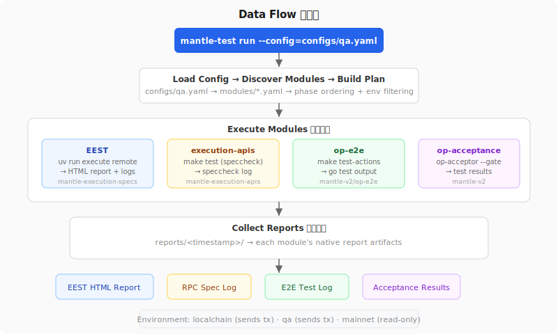

# 架构设计

## 概述




mantle-test-v1 是一个**通用测试编排平台**，用于 Mantle 链级别的行为验证。它调度测试模块、管理环境、收集原生报告、执行跨模块比对。

**核心设计原则：** 编排器不实现任何测试逻辑。每个模块是独立仓库，有自己的测试、CI 和报告。编排器只负责调用、收集、比对。

**可扩展性：** 新模块只需添加一个 YAML manifest 即可接入，无需修改编排器代码。

## 测试层级

| 层级 | 模块 | 验证内容 |
|------|------|---------|
| EVM 一致性 | EEST (mantle-execution-specs) | opcode gas、precompile、交易执行、状态转换 |
| RPC 合规 | execution-apis (mantle-execution-apis) | JSON-RPC method 参数、返回值、错误码 |
| OP Stack E2E + 验收 | op-e2e + op-acceptance-tests | deposit/withdraw、sequencer、fault proof、operator fee、gas oracle |
| 多客户端 | Hive（未来） | P2P、同步、Engine API、跨客户端共识 |

## 编排器

```
orchestrator/
├── cmd/mantle-test/       # CLI：run、plan
├── pkg/
│   ├── module/            # YAML manifest 解析 + 模块注册
│   ├── config/            # 环境配置 + ${ENV_VAR} 解析
│   ├── adapter/           # exec（shell 命令）+ ci-trigger（GitHub API）
│   ├── environment/       # unit / localchain / qa / mainnet
│   ├── phase/             # Phase 排序 + DAG 依赖 + 并行调度
│   ├── orchestrator/      # 顶层 Run() + 报告收集
│   └── result/            # 解析器（go test JSON, JUnit XML, EEST）
├── modules/               # 模块 manifest（YAML）
└── configs/               # 环境配置
```

### 模块插件接口

每个模块通过 YAML manifest 定义：

```yaml
name: module-name
suites:
  - name: suite-name
    phase: unit | integration | e2e | acceptance
    environments: [localchain, qa, mainnet]
    command: "执行的 shell 命令"
    env_vars: [L2_RPC_URL, L2_CHAIN_ID, ...]
    result_format: gotest-json | junit-xml | eest-json
    timeout: 30m
```

编排器的工作流：
1. 从 `modules/*.yaml` 发现模块
2. 按环境和 phase 过滤
3. 注入环境变量后执行 `command`
4. 收集原生报告到 `reports/<timestamp>/<module>/`
5. 多客户端一致性：两个客户端都 PASS 同一套 EEST = 行为一致（不需要 diff 工具）

### 数据流

见上方[数据流图](images/data-flow.svg)。

### 环境矩阵

| 环境 | RPC | 发交易 | 用途 |
|------|-----|--------|------|
| localchain | localhost | 是 | 本地 devnet，全量测试 |
| qa | QA RPC | 是 | QA 环境验证 |
| mainnet | mainnet RPC | **否** | 只读 RPC 合规验证 |

## 各模块仓库

| 模块 | 仓库位置 | 说明 |
|------|---------|------|
| EEST | mantle-execution-specs（fork） | EVM 测试用例 + 框架，需独立 CI |
| execution-apis | mantle-execution-apis（fork） | RPC 规范 + 测试工具，需独立 CI |
| op-e2e | mantle-v2/op-e2e | 已适配 Mantle，173 个测试文件，CI 调用即可 |
| op-acceptance | mantle-v2 内或 optimism fork | 已有 Mantle 测试，CI 调用即可 |

每个 fork 仓库：
- `origin` → mantlenetworkio（push）
- `upstream` → 官方仓库（通过 `git merge` 同步）
- 有自己的 CI 独立运行测试
- 可被编排器调用，也可独立运行
