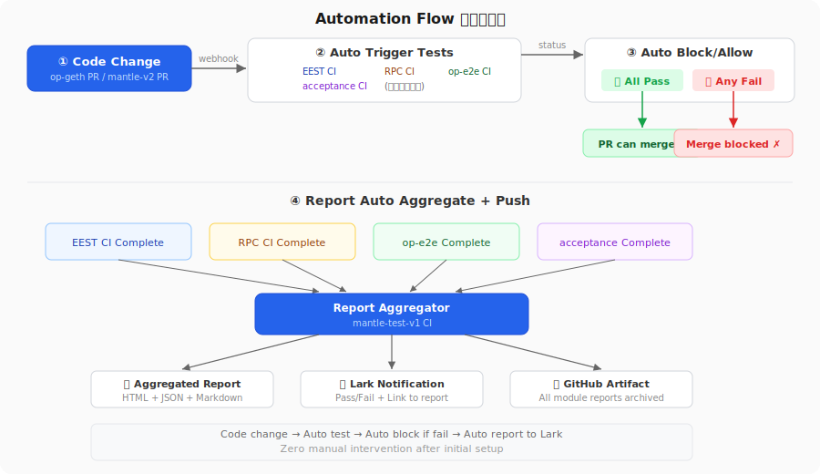

# 自动化设计

## 三个核心自动化能力



### 1. 代码变更 → 自动触发对应测试

**问题：** 当前各模块 CI 只在自己仓库的 push/PR 时触发。但 op-geth 改了代码，EEST 应该自动跑——目前不会。

**方案：跨仓库 webhook 联动**

```
op-geth PR 合入
  → GitHub webhook 触发 mantle-execution-specs CI（跑 EEST）
  → GitHub webhook 触发 mantle-v2 op-e2e CI
  → 结果回写到 op-geth PR 的 status check

mantle-v2 PR 合入
  → 自动触发 op-e2e + op-acceptance CI
  → 结果回写到 mantle-v2 PR 的 status check

mantle-execution-specs PR
  → 自动跑 EEST
  → 结果回写到 PR
```

**实现：每个源仓库加一个 webhook workflow**

```yaml
# op-geth/.github/workflows/trigger-eest.yml
name: Trigger EEST on op-geth change

on:
  pull_request:
    types: [opened, synchronize]
  push:
    branches: [main, develop]

jobs:
  trigger-eest:
    runs-on: ubuntu-latest
    steps:
      - name: Trigger EEST CI
        uses: peter-evans/repository-dispatch@v3
        with:
          token: ${{ secrets.CROSS_REPO_TOKEN }}
          repository: mantlenetworkio/mantle-execution-specs
          event-type: upstream-change
          client-payload: |
            {
              "source_repo": "op-geth",
              "source_ref": "${{ github.sha }}",
              "source_pr": "${{ github.event.pull_request.number }}",
              "callback_repo": "${{ github.repository }}"
            }

      - name: Trigger op-e2e CI
        uses: peter-evans/repository-dispatch@v3
        with:
          token: ${{ secrets.CROSS_REPO_TOKEN }}
          repository: mantlenetworkio/mantle-v2
          event-type: upstream-change
          client-payload: |
            {
              "source_repo": "op-geth",
              "source_ref": "${{ github.sha }}",
              "test_suite": "op-e2e"
            }
```

```yaml
# mantle-execution-specs/.github/workflows/mantle-test.yaml
# 增加 repository_dispatch 触发
on:
  push:
    branches: [mantle/main]
  pull_request:
    branches: [mantle/main]
  repository_dispatch:
    types: [upstream-change]
  workflow_dispatch:

jobs:
  evm-conformance:
    runs-on: ubuntu-latest
    steps:
      # ... 跑 EEST ...

      # 把结果回写到源 PR（如果是 upstream-change 触发的）
      - name: Report back to source PR
        if: github.event_name == 'repository_dispatch'
        uses: actions/github-script@v7
        with:
          github-token: ${{ secrets.CROSS_REPO_TOKEN }}
          script: |
            const source = context.payload.client_payload;
            await github.rest.repos.createCommitStatus({
              owner: source.callback_repo.split('/')[0],
              repo: source.callback_repo.split('/')[1],
              sha: source.source_ref,
              state: '${{ job.status }}' === 'success' ? 'success' : 'failure',
              target_url: '${{ github.server_url }}/${{ github.repository }}/actions/runs/${{ github.run_id }}',
              context: 'EEST EVM Conformance',
              description: 'EVM conformance test ${{ job.status }}'
            });
```

**触发矩阵：**

| 源仓库代码变更 | 自动触发的测试 | 原因 |
|-------------|-------------|------|
| op-geth PR | EEST + op-e2e | EVM 实现变了，要验证一致性 |
| mantle-v2 PR | op-e2e + op-acceptance | OP Stack 组件变了 |
| mantle-execution-specs PR | EEST | 测试用例或适配代码变了 |
| mantle-execution-apis PR | speccheck | RPC spec 变了 |
| reth PR（未来） | EEST | 另一个客户端，同样需要验证 |

---

### 2. 失败 → 自动阻断合并

**问题：** 测试失败了，PR 仍然可以合入。

**方案：GitHub Branch Protection + Required Status Checks**

```
每个仓库的 main/develop 分支设置 Branch Protection Rule:
  ✅ Require status checks to pass before merging
  ✅ Require branches to be up to date before merging

Required status checks:
  op-geth:
    - "EEST EVM Conformance"     ← 跨仓库回写的 status
    - "op-e2e Tests"             ← 跨仓库回写的 status

  mantle-v2:
    - "op-e2e Tests"
    - "op-acceptance Tests"

  mantle-execution-specs:
    - "EEST Execute Remote"      ← 自己的 CI
```

**配置方式（GitHub API）：**

```bash
# 设置 op-geth 的 branch protection
gh api repos/mantlenetworkio/op-geth/branches/main/protection \
  --method PUT \
  --field required_status_checks='{"strict":true,"contexts":["EEST EVM Conformance","op-e2e Tests"]}' \
  --field enforce_admins=true
```

**效果：**
```
开发者提 op-geth PR
  → 自动触发 EEST CI + op-e2e CI
  → EEST 跑完，结果回写到 PR status
  → 如果 FAIL → PR 显示 ❌ "EEST EVM Conformance — failure"
  → GitHub 阻止合入 → 必须修复后才能 merge
```

---

### 3. 报告 → 自动汇总推送

**问题：** 测试报告分散在各仓库的 CI artifacts 里，需要手动找。

**方案：中心化报告服务**

```yaml
# mantle-test-v1/.github/workflows/report-aggregator.yml
name: Report Aggregator

on:
  # 监听所有模块 CI 完成
  repository_dispatch:
    types: [module-ci-complete]
  # 定时汇总
  schedule:
    - cron: '0 8 * * *'  # 每天 8:00 UTC

jobs:
  aggregate:
    runs-on: ubuntu-latest
    steps:
      - uses: actions/checkout@v4

      - name: Download EEST report
        uses: dawidd6/action-download-artifact@v6
        with:
          repo: mantlenetworkio/mantle-execution-specs
          workflow: mantle-test.yaml
          name: eest-report
          path: reports/latest/eest/
        continue-on-error: true

      - name: Download execution-apis report
        uses: dawidd6/action-download-artifact@v6
        with:
          repo: mantlenetworkio/mantle-execution-apis
          workflow: mantle-test.yaml
          name: openrpc-spec
          path: reports/latest/execution-apis/
        continue-on-error: true

      - name: Generate summary
        run: |
          python3 scripts/generate-summary.py \
            --reports-dir=reports/latest/ \
            --output=reports/latest/summary.md

      - name: Push to Lark
        env:
          LARK_WEBHOOK: ${{ secrets.LARK_WEBHOOK }}
        run: |
          python3 scripts/push-to-lark.py \
            --summary=reports/latest/summary.md \
            --webhook=$LARK_WEBHOOK

      - name: Upload aggregated report
        uses: actions/upload-artifact@v4
        with:
          name: aggregated-report-${{ github.run_number }}
          path: reports/latest/
```

**Lark 推送脚本：**

```python
# scripts/push-to-lark.py
import json, requests, sys, argparse

def push_to_lark(summary_path, webhook_url):
    with open(summary_path) as f:
        summary = f.read()

    # 解析 summary 提取关键数据
    payload = {
        "msg_type": "interactive",
        "card": {
            "header": {
                "title": {"tag": "plain_text", "content": "Mantle Test Report"},
                "template": "green"  # or "red" if failures
            },
            "elements": [
                {
                    "tag": "markdown",
                    "content": summary[:2000]  # Lark limit
                },
                {
                    "tag": "action",
                    "actions": [{
                        "tag": "button",
                        "text": {"tag": "plain_text", "content": "View Full Report"},
                        "url": "https://github.com/mantlenetworkio/mantle-test-v1/actions",
                        "type": "primary"
                    }]
                }
            ]
        }
    }

    requests.post(webhook_url, json=payload)

if __name__ == "__main__":
    parser = argparse.ArgumentParser()
    parser.add_argument("--summary", required=True)
    parser.add_argument("--webhook", required=True)
    args = parser.parse_args()
    push_to_lark(args.summary, args.webhook)
```

**报告汇总格式：**

```markdown
# Mantle Test Report — 2026-04-08

## Status: ✅ All Passed

| Module | Tests | Passed | Failed | Report |
|--------|-------|--------|--------|--------|
| EEST (EVM) | 686 | 686 | 0 | [HTML](link) |
| execution-apis (RPC) | 38 | 38 | 0 | [Log](link) |
| op-e2e | 173 files | — | — | [Log](link) |
| op-acceptance | base+mantle gate | — | — | [Log](link) |

Triggered by: op-geth PR #1234
Environment: QA (chain_id=1115511107)
```

---

## 自动化触发完整流程

```
开发者提 op-geth PR
  │
  ├── op-geth CI（自有单元测试）
  │
  ├── webhook → mantle-execution-specs CI
  │   └── EEST execute remote → 结果回写 op-geth PR status
  │
  ├── webhook → mantle-v2 CI
  │   ├── op-e2e → 结果回写 op-geth PR status
  │   └── op-acceptance → 结果回写 op-geth PR status
  │
  ├── 所有 status check PASS？
  │   ├── YES → PR 可以 merge
  │   └── NO → ❌ 阻断合入，开发者必须修复
  │
  └── CI 完成 → repository_dispatch → mantle-test-v1 report-aggregator
      └── 汇总报告 → 推送 Lark
```

---

## 需要配置的 Secrets

| Secret | 仓库 | 用途 |
|--------|------|------|
| `CROSS_REPO_TOKEN` | 所有仓库 | GitHub PAT，用于跨仓库 dispatch + status 回写 |
| `LARK_WEBHOOK` | mantle-test-v1 | Lark 机器人 webhook URL |
| `L2_RPC_URL` | mantle-execution-specs | Mantle QA RPC |
| `L2_CHAIN_ID` | mantle-execution-specs | Chain ID |
| `SEED_KEY` | mantle-execution-specs | 测试充值账户私钥 |

---

## 实施步骤

| 步骤 | 工作量 | 说明 |
|------|--------|------|
| 1. 各源仓库加 webhook workflow | 1 天 | op-geth, mantle-v2 各加一个 trigger workflow |
| 2. 各模块 CI 加 status 回写 | 1 天 | mantle-execution-specs, mantle-v2 的 CI 完成后回写源 PR |
| 3. 配置 Branch Protection | 0.5 天 | 各仓库设 required status checks |
| 4. 写 report aggregator | 1 天 | summary 生成 + Lark 推送脚本 |
| 5. 配置 Secrets | 0.5 天 | CROSS_REPO_TOKEN, LARK_WEBHOOK 等 |
| 6. 验证端到端 | 1 天 | 提一个 op-geth PR 验证全流程 |
| **总计** | **5 天** | |
