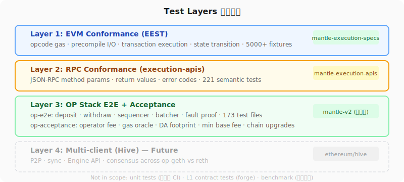
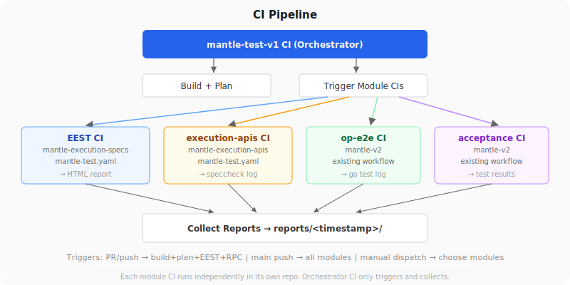

# Mantle Test Framework 方案

## 1. 背景与目标

### 1.1 行业对比

详见 [industry-comparison.md](industry-comparison.md)。

| | Optimism | Base | **Mantle（新方案）** |
|--|---------|------|---------------------|
| EVM 一致性 | 依赖 op-geth 继承 | 同 Optimism | **fork EEST 直接对链跑** |
| RPC 合规 | 无 | 无 | **fork execution-apis** |
| 多客户端验证 | 推进中 | op-geth→reth 迁移中 | **EEST 两端跑** |
| 统一编排 | 无 | 无 | **mantle-test-v1** |
| 验收测试 | op-acceptance | 同 Optimism | op-acceptance + **Mantle gate** |

Mantle 新方案在 EVM 一致性验证、RPC 合规、统一编排方面领先于其他 OP Stack 公链。

### 1.2 现状问题

| 问题 | 说明 |
|------|------|
| EVM 测试不足 | 现有 chainregression 的 opcode/precompile 测试覆盖浅，缺少边界条件和 gas 精确验证 |
| 缺少标准化验证 | 无法证明 Mantle 的 EVM 行为与以太坊标准一致 |
| 多客户端迁移风险 | op-geth → reth 迁移需要验证两个客户端行为完全一致，目前没有工具 |
| 测试分散 | 各模块各自测试，没有统一入口和报告 |
| RPC 合规不完整 | 没有系统性验证 Mantle 节点的 JSON-RPC 接口是否符合以太坊规范 |

### 1.2 目标

1. **EVM 一致性**：使用以太坊官方 5000+ 测试用例验证 Mantle EVM 与以太坊标准一致
2. **RPC 合规**：使用以太坊官方 RPC 规范验证 Mantle 节点接口合规
3. **多客户端安全**：两个客户端（op-geth、reth）通过同一套标准测试 = 行为一致
4. **统一编排**：一个入口调度所有测试模块，收集所有报告
5. **可扩展**：新模块只需一个 YAML 文件即可接入，零代码改动

---

## 2. 整体架构


### 2.1 设计原则

- **编排器不实现测试逻辑**：每个模块在自己的仓库有自己的测试、CI 和报告
- **编排器只做三件事**：调度执行、管理环境、收集报告
- **模块即插即用**：一个 YAML manifest 定义模块如何被调用
- **复用官方工具**：不重造轮子，fork 以太坊官方测试框架并适配

### 2.2 组成模块



| 层级 | 模块 | 来源 | 验证内容 | 测试数量 |
|------|------|------|---------|---------|
| **Layer 1** | EEST | fork of ethereum/execution-specs | opcode gas、precompile、交易执行、状态转换 | 5000+ |
| **Layer 2** | execution-apis | fork of ethereum/execution-apis | JSON-RPC method 参数、返回值、错误码 | 221 |
| **Layer 3** | op-e2e + op-acceptance | mantle-v2（已适配） | deposit/withdraw、sequencer、fault proof、operator fee、gas oracle | 173 文件 |
| **Layer 4** | Hive（未来） | ethereum/hive | P2P、同步、Engine API、多客户端共识 | — |

### 2.3 不在本框架范围

| 测试 | 归属 |
|------|------|
| 各模块单元测试 | 各项目自有 CI（op-geth `make test`、contracts `forge test`） |
| L1 合约测试 | mantle-v2/packages/contracts-bedrock (`forge test`) |
| 压测 | 独立项目 |

---

## 3. 为什么选择 EEST 和 execution-apis

### 3.1 EEST（ethereum/execution-specs）

**EEST 是什么：** 以太坊基金会官方维护的 Execution Layer 测试框架，所有主流客户端（geth、reth、besu、nethermind、erigon）都使用它来验证自己的 EVM 实现。

**为什么用它而不是自己写：**

| 对比 | 自己写 | EEST |
|------|--------|------|
| 测试数量 | chainregression ~100 个 EVM 相关 | **5000+** 用例 |
| 边界覆盖 | 手动写边界用例 | **每个 opcode 都有 overflow/underflow/OOG/零值/最大值测试** |
| gas 验证精度 | 只验证结果 | **精确到单个 opcode 的 gas 消耗（用 GAS opcode 做差值）** |
| 维护方 | Mantle 团队 | **以太坊基金会 STEEL 团队**，持续更新 |
| 客户端验证 | 只对 Mantle | 用于验证 geth/reth/besu/nethermind/erigon |
| 多客户端比对 | 需要自建 diff 工具 | **两个客户端都 PASS = 行为一致** |
| 新 EIP 覆盖 | 需要自己跟进 | **每个新 EIP 激活前就有测试** |

**核心验证机制：**

```
EEST 定义：pre-state + transaction → expected post-state

验证方式：
1. 设置链上 pre-state（账户余额、合约代码、storage）
2. 发送测试交易
3. 读取链上 post-state
4. 逐字段比对：storage 每个 slot、balance 每个 wei、code 每个 byte
5. 完全匹配 = PASS，任何差异 = FAIL

gas 验证方式：
1. 在合约内用 GAS opcode 记录执行前后的 gas
2. gas 差值存到 storage
3. 在 post-state 中断言 gas 差值 == 标准定义的 gas 消耗
→ 精确到单个 opcode 级别
```

### 3.2 execution-apis（ethereum/execution-apis）

**execution-apis 是什么：** 以太坊官方的 JSON-RPC 接口规范，用 OpenRPC 格式定义每个 RPC method 的参数、返回值和错误码。

**两个官方工具：**

| 工具 | 功能 |
|------|------|
| `rpctestgen` | 对客户端跑 221 个语义测试（参数正确性 + 返回值正确性），生成 `.io` 测试文件 |
| `speccheck` | 验证 `.io` 文件的格式是否符合 OpenRPC schema |

**为什么需要：**
- EEST 通过 RPC 发交易来验证 EVM，但它**不测 RPC 本身**
- execution-apis 验证 RPC 接口**格式和语义**是否正确
- 两者互补：EEST 测 EVM 行为，execution-apis 测 RPC 接口

---

## 4. Mantle 适配

### 4.1 EEST 需要哪些适配

Mantle 是 OP Stack L2，和以太坊 L1 有以下差异导致 EEST 不能直接运行：

| # | 差异 | EEST 原始行为 | Mantle 适配 |
|---|------|-------------|------------|
| 1 | **EIP-155 强制** | 部署 deterministic factory 用 pre-EIP-155 tx | 改为 fallback 到 EIP-155 protected tx |
| 2 | **L2 额外费用** | 按 `gas × gasPrice` 计算 EOA 充值金额 | 自动查询 GasPriceOracle 计算 L1 data fee，增加充值量 |
| 3 | **Min base fee** | 测试 tx 硬编码 gas_price=10 wei | 自动提升到网络 base fee 水平 |
| 4 | **不支持 blob tx** | 包含 EIP-4844 blob 交易测试 | 运行时排除 `--deselect=tests/cancun/eip4844` |

**所有适配通过 CLI 参数控制，不改测试用例本身：**

```bash
uv run execute remote \
  --fork=Cancun \
  --rpc-endpoint=$MANTLE_RPC \
  --chain-id=$CHAIN_ID \
  --rpc-seed-key=$SEED_KEY \
  --l2-funding-overhead=auto \         # 适配 #2：自动查询 GasPriceOracle
  --l2-force-min-gas-price \           # 适配 #3：强制 min gas price
  --skip-cleanup \                     # 避免退款 tx 因 L1 fee 失败
  --seed-account-sweep-amount=10ETH \  # 控制资金分配
  --deselect=tests/cancun/eip4844     # 适配 #4：排除 blob 测试
```

### 4.2 适配代码位置

所有适配在 `mantle-execution-specs` fork 仓库中，共修改 6 个文件：

| 文件 | 行号 | 修改内容 |
|------|------|---------|
| `execute/contracts.py` | L37-148 | EIP-155 fallback 部署 factory |
| `execute/pre_alloc.py` | L125-136, L287-322, L697-723, L985-1108 | `--l2-funding-overhead=auto` + 动态查询 GasPriceOracle |
| `execute/execute.py` | L172-183, L228, L717-729 | `--l2-force-min-gas-price` + HTML 报告 bug fix |
| `test_types/transaction_types.py` | L814-835 | 强制 min gas price 逻辑 |
| `execution/transaction_post.py` | L50, L63 | 参数传递 |
| `execution/base.py` | L53, L57 | 基类签名更新 |

### 4.3 验证结果

| 测试集 | 用例数 | 结果 |
|--------|--------|------|
| frontier/opcodes (DUP1-16) | 16 | ✅ 16 passed |
| frontier 全量 | 686 | ✅ 0 FAIL |
| frontier/precompiles + create + identity | 120 | ✅ 107 passed, 13 因 funding 不足（已修复） |
| 标准 RPC 合规 | 15 method | ✅ 15/15 passed |
| GasPriceOracle 合约 | 10 method | ✅ 8 passed, 2 revert（Arsia 未激活，预期） |

---

## 5. 如何添加测试用例

### 5.1 在 EEST 中添加（EVM 相关）

在 `mantle-execution-specs/tests/` 目录下写 Python 测试函数：

```python
# tests/frontier/opcodes/test_my_opcode.py
from execution_testing import Account, Alloc, Environment, Op, StateTestFiller, Transaction

def test_my_opcode_case(state_test: StateTestFiller, pre: Alloc):
    """验证某个 opcode 的行为。"""
    sender = pre.fund_eoa()
    contract = pre.deploy_contract(
        code=Op.SSTORE(0, Op.ADD(1, 2)) + Op.STOP  # ADD(1,2) 结果存到 slot 0
    )
    tx = Transaction(to=contract, gas_limit=100000, sender=sender)
    post = {
        contract: Account(storage={0: 3})  # 期望 slot 0 = 3
    }
    state_test(env=Environment(), pre=pre, tx=tx, post=post)
```

**放进 `tests/` 目录就自动被发现，不需要注册。**

验证：
```bash
cd mantle-execution-specs
uv run execute remote ... tests/frontier/opcodes/test_my_opcode.py
```

### 5.2 在 op-acceptance 中添加（L2 业务相关）

operator fee、gas oracle、DA footprint 等 Mantle 特有逻辑放在 acceptance 测试中：

```go
// mantle-v2/op-acceptance-tests/tests/mantle/operator_fee/test_operator_fee.go
func TestOperatorFeeDeduction(t *testing.T) {
    // 发送交易前记录 sender balance
    // 发送交易
    // 验证 balance 变化 = L2 fee + L1 fee + operator fee
    // 验证 operator fee vault 余额增加
}
```

### 5.3 在 execution-apis 中添加（RPC 相关）

添加 Mantle 自定义 RPC method 到 OpenRPC schema：

```yaml
# mantle-execution-apis/src/eth/mantle_getL1DataFee.yaml
- name: mantle_getL1DataFee
  params:
    - name: data
      schema: { type: string }
  result:
    name: fee
    schema: { type: string, pattern: "^0x[0-9a-f]+$" }
```

---

## 6. 如何集成新模块

### 6.1 步骤

1. **写一个 YAML manifest**，放到 `orchestrator/modules/`：

```yaml
name: my-new-module
description: 我的新测试模块
repo: mantlenetworkio/my-module

suites:
  - name: my-tests
    phase: e2e                           # unit | integration | e2e | acceptance
    environments: [localchain, qa]       # 支持哪些环境
    command: "cd $MODULE_DIR && make test-e2e"  # 执行的 shell 命令
    env_vars: [MODULE_DIR, L2_RPC_URL, L2_CHAIN_ID]  # 需要注入的环境变量
    result_format: gotest-json           # 结果格式
    timeout: 30m
```

2. **验证**：
```bash
cd orchestrator
./bin/mantle-test plan --config=configs/localchain.yaml
# 应该能看到新模块出现在计划中
```

3. **运行**：
```bash
./bin/mantle-test run --config=configs/localchain.yaml --modules=my-new-module
```

### 6.2 Module Manifest 字段说明

| 字段 | 必填 | 说明 |
|------|------|------|
| `name` | ✅ | 模块唯一标识 |
| `description` | ✅ | 模块说明 |
| `repo` | | 仓库地址（文档用） |
| `suites[].name` | ✅ | 套件名称 |
| `suites[].phase` | ✅ | 执行阶段，决定执行顺序 |
| `suites[].environments` | ✅ | 支持的环境列表，不匹配则跳过 |
| `suites[].command` | ✅ | 执行的 shell 命令 |
| `suites[].env_vars` | | orchestrator 注入的环境变量 |
| `suites[].result_format` | ✅ | 结果解析格式 |
| `suites[].timeout` | ✅ | 超时时间 |
| `suites[].depends_on` | | 依赖的其他 suite（如 `["op-node:sync"]`） |

---

## 7. 使用方式

### 7.1 通过 Orchestrator

```bash
# 构建
cd mantle-test-v1/orchestrator
go build -o bin/mantle-test ./cmd/mantle-test/

# 查看执行计划
./bin/mantle-test plan --config=configs/localchain.yaml

# 执行所有模块
./bin/mantle-test run --config=configs/localchain.yaml

# 执行特定模块
./bin/mantle-test run --config=configs/qa.yaml --modules=eest

# 快速失败模式
./bin/mantle-test run --config=configs/localchain.yaml --fail-fast
```

### 7.2 直接运行单个模块

每个模块也可以独立运行，不通过 orchestrator：

**EEST：**
```bash
cd mantle-execution-specs
uv run execute remote --fork=Cancun --rpc-endpoint=$RPC --chain-id=$CHAIN_ID \
  --rpc-seed-key=$KEY --l2-funding-overhead=auto --l2-force-min-gas-price \
  --skip-cleanup --seed-account-sweep-amount=10000000000000000000
```

**execution-apis：**
```bash
cd mantle-execution-apis
make tools && make test
```

**op-e2e：**
```bash
cd mantle-v2/op-e2e
make test-actions
```

### 7.3 环境配置

| 环境 | 配置文件 | 发交易 | 适用场景 |
|------|---------|--------|---------|
| localchain | configs/localchain.yaml | 是 | 本地 devnet 全量测试 |
| qa | configs/qa.yaml | 是 | QA 环境验证 |
| mainnet | configs/mainnet.yaml | **否** | 只读 RPC 合规验证 |

### 7.4 报告

每个模块生成自己的原生报告，orchestrator 收集到 `reports/<timestamp>/`：

| 模块 | 报告格式 | 位置 |
|------|---------|------|
| EEST | HTML（pytest-html） | `execution_results/report_execute.html` |
| execution-apis | speccheck 日志 | stdout |
| op-e2e | go test 输出 | stdout / `-json` |
| op-acceptance | test results | stdout |

---

## 8. CI 流程



每个模块在各自仓库有独立 CI：

| 模块 | CI 位置 | 触发条件 |
|------|---------|---------|
| EEST | `mantle-execution-specs/.github/workflows/mantle-test.yaml` | push to mantle/main, manual |
| execution-apis | `mantle-execution-apis/.github/workflows/mantle-test.yaml` | push to mantle/main |
| op-e2e | `mantle-v2/.github/workflows/` | 已有 |
| op-acceptance | `mantle-v2/` | 已有 |

Orchestrator CI（`mantle-test-v1/.github/workflows/test.yml`）负责触发各模块 CI 并收集报告。

---

## 9. 仓库一览

| 仓库 | 类型 | 说明 |
|------|------|------|
| **mantle-test-v1** | 自建 | 编排器 + 模块 manifest + 环境配置 + 文档 |
| **mantle-execution-specs** | fork of ethereum/execution-specs | EVM 一致性测试（已适配 Mantle L2） |
| **mantle-execution-apis** | fork of ethereum/execution-apis | RPC 合规测试 |
| **mantle-v2** | 已有 | op-e2e + op-acceptance（已适配 Mantle） |

Fork 仓库同步上游：
```bash
git fetch upstream && git merge upstream/<branch>
# 解决 Mantle 适配部分的冲突 → push
```

---

## 10. chainregression 迁移

chainregression 弃用，所有测试内容迁移到新框架的对应模块。以下是完整的迁移映射：

### 10.1 EVM 相关 → EEST

EEST 5000+ 用例已覆盖，精度更高（验证每个 storage slot、每个 wei、每个 opcode 的 gas）。

| chainregression 原位置 | 测试内容 | EEST 对应位置 | 覆盖状态 |
|----------------------|---------|-------------|---------|
| `opcode/computational/` | 算术/逻辑 opcode 测试 | `tests/frontier/opcodes/test_all_opcodes.py` | ✅ 已覆盖，含 stack overflow/underflow |
| `opcode/evmcontrol/` | EVM 控制流 opcode | `tests/frontier/opcodes/test_call.py` 等 | ✅ 已覆盖，含 CALL/DELEGATECALL/STATICCALL |
| `precompiles/` | ecrecover, sha256, ripemd, bn128 等 | `tests/frontier/precompiles/test_precompiles.py` | ✅ 已覆盖，含 OOG/边界输入 |
| `precompiles/v3/` | 新版 precompile | `tests/cancun/` 相关 EIP 测试 | ✅ 已覆盖 |
| `evm/storage/` | SLOAD/SSTORE | `tests/berlin/eip2929_gas_cost_increases/` | ✅ 已覆盖，含 cold/warm access gas |
| `transaction/transactiontype/` | legacy/EIP-2930/EIP-1559 交易 | `tests/berlin/eip2930_access_list/`、`tests/london/eip1559_fee_market_change/` | ✅ 已覆盖 |

### 10.2 EIP 相关 → EEST

| chainregression 原位置 | EEST 对应位置 | 覆盖状态 |
|----------------------|-------------|---------|
| `EIP/eip1153/` (TSTORE/TLOAD) | `tests/cancun/eip1153_tstore/` | ✅ |
| `EIP/eip1559/` (Fee market) | `tests/london/eip1559_fee_market_change/` | ✅ |
| `EIP/eip2935/` (Historical block hashes) | `tests/prague/eip2935_historical_block_hashes_from_state/` | ✅ |
| `EIP/eip3855/` (PUSH0) | `tests/shanghai/eip3855_push0/` | ✅ |
| `EIP/eip4788/` (Beacon root) | `tests/cancun/eip4788_beacon_root/` | ✅ |
| `EIP/eip4844/` (Blob tx) | `tests/cancun/eip4844_blobs/` | ⚠️ Mantle 不支持 blob，需排除 |
| `EIP/eip4895/` (Withdrawals) | `tests/shanghai/eip4895_withdrawals/` | ✅ |
| `EIP/eip5656/` (MCOPY) | `tests/cancun/eip5656_mcopy/` | ✅ |
| `EIP/eip6780/` (SELFDESTRUCT) | `tests/cancun/eip6780_selfdestruct/` | ✅ |
| `EIP/eip7212/` (secp256r1) | 需确认 EEST 是否已有 | 🔲 待确认 |
| `EIP/eip7516/` (BLOBBASEFEE) | `tests/cancun/eip7516_blobgasfee/` | ⚠️ 语义在 Mantle 上不同 |
| `EIP/eip7685/` (General purpose EL requests) | `tests/prague/eip7685_general_purpose_el_requests/` | ✅ |
| `EIP/eip7702/` (Set code tx) | `tests/prague/eip7702_set_code_tx/` | ✅ |
| `EIP/eip7823eip7883/` | 需确认 | 🔲 待确认 |
| `EIP/eip7934/` | 需确认 | 🔲 待确认 |
| `EIP/eip7939/` | `tests/osaka/eip7939_count_leading_zeros/` | ✅ |
| `EIP/eip7951/` | Mantle 自定义，EEST 无 | → op-acceptance |

### 10.3 RPC 相关 → execution-apis

| chainregression 原位置 | 测试内容 | 迁移到 | 说明 |
|----------------------|---------|--------|------|
| `rpc/method/` | 标准 RPC method 调用 | execution-apis `rpctestgen` | 221 个语义测试 |
| `rpc/estimategas/` | L2 gas 估算准确性（预估 vs 实际、多节点一致性、不同交易类型、L1 fee 包含） | op-acceptance Mantle gate | **不能放 EEST**（这是 L2 特有逻辑：estimateGas 包含 L1 data fee + operator fee 折算，gasUsed 只有 execution gas） |
| `rpc/estimategas-old/` | 旧版 gas 估算 | 弃用 | |
| `rpc/gasrefund/` | gas refund 机制 | EEST（EVM 层面已覆盖）| |
| `rpc/l1rpc/` | L1 RPC 交互 | op-e2e | L1↔L2 交互测试 |
| `rpc/metaTX/` | meta transaction | op-acceptance | |
| `rpc/optimismsafeheadatl1block/` | safe head 查询 | op-e2e | 已有 safedb 测试 |
| `rpc/check_txpool_max_gas.sh` | txpool gas 限制 | op-e2e | |

### 10.4 交易/跨链相关 → op-e2e / op-acceptance

| chainregression 原位置 | 测试内容 | 迁移到 | 说明 |
|----------------------|---------|--------|------|
| `transaction/deposit/` | L1→L2 deposit | op-e2e `actions/mantletests/` | 已有 |
| `transaction/withdraw/` | L2→L1 withdraw | op-e2e | 已有 |
| `transaction/preconf/` | preconfirmation | op-e2e | |
| `transaction/transfer_native_test.go` | 原生转账 | EEST（基础交易已覆盖）| |
| `transaction/transferERC20_test.go` | ERC20 转账 | op-acceptance | |
| `transaction/unprtectedTX_test.go` | unprotected tx | 不需要（Mantle 强制 EIP-155）| |
| `transaction/transfer_to_optimism_portal_proxy_test.go` | Portal 交互 | op-e2e | |

### 10.5 Mantle 特有 → op-acceptance Mantle gate

| chainregression 原位置 | 测试内容 | 迁移到 | 说明 |
|----------------------|---------|--------|------|
| `evm/operatorfee/` | operator fee 计算/扣款 | op-acceptance `mantle-arsia` gate | |
| `rpc/token_ratio_test.go` | token ratio | op-acceptance Mantle gate | |
| `token/erc20/` | ERC20 token 操作 | op-acceptance | |
| `token/erc20nodeps/` | 无依赖 ERC20 测试 | op-acceptance | |
| `EIP/eip7951/` | Mantle 自定义 EIP | op-acceptance Mantle gate | |

### 10.6 其他

| chainregression 原位置 | 迁移到 | 说明 |
|----------------------|--------|------|
| `benchmark/` | 独立压测项目 | 不在本框架 |
| `config/` | 不需要迁移 | 各模块有自己的配置 |
| `helper/` / `lib/` | 不需要迁移 | 各模块有自己的工具库 |
| `op-bindings/` | 不需要迁移 | mantle-v2 已有 |
| `holder/` | 不需要迁移 | 临时数据 |

---

## 11. 后续计划

| 优先级 | 任务 |
|--------|------|
| P0 | EEST fork 仓库推到 mantlenetworkio + CI |
| P0 | execution-apis fork 仓库推到 mantlenetworkio + CI |
| P0 | EEST 全量测试跑通（frontier → cancun） |
| P1 | execution-apis rpctestgen 适配远程 RPC |
| P1 | op-acceptance 新增 Mantle gate（operator fee, gas oracle, DA footprint） |
| P2 | Hive 多客户端测试（op-geth vs reth） |
| P2 | mantle-test-v1 orchestrator 完善（CI trigger, 报告收集） |
