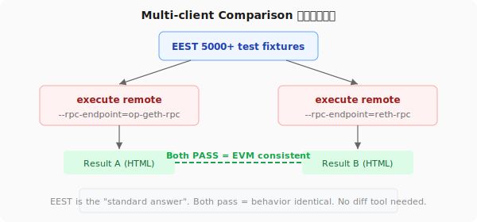

# Module Compatibility Assessment

## Overview

本文档评估各测试模块与 Mantle 的适配性，以及接入 mantle-test-v1 编排平台所需的工作。

---

## 已评估模块

### 1. EEST (ethereum/execution-specs)

| 项目 | 内容 |
|------|------|
| **上游仓库** | https://github.com/ethereum/execution-specs |
| **Fork 仓库** | mantle-execution-specs (`/Users/user/space/mantle-execution-specs/`) |
| **适配状态** | ✅ 已适配并验证 |
| **测试数量** | 5000+ fixture，frontier 全量 686 用例已跑通 0 FAIL |
| **适配修改** | EIP-155 fallback, L2 funding overhead (auto), min gas price 强制, HTML 报告 bug fix |
| **修改文件数** | 6 个文件（详见 l2-adaptations.md） |
| **CI 状态** | 🔲 需要在 fork 仓库配置 CI |
| **报告格式** | HTML (pytest-html) + logs |

**接入 orchestrator 方式：**
```yaml
name: eest
command: |
  cd $SPECS_DIR && uv run execute remote \
    --fork=Cancun \
    --rpc-endpoint=$L2_RPC_URL \
    --chain-id=$L2_CHAIN_ID \
    --rpc-seed-key=$SEED_KEY \
    --l2-funding-overhead=auto \
    --l2-force-min-gas-price \
    --skip-cleanup \
    --seed-account-sweep-amount=10000000000000000000
```

---

### 2. execution-apis (ethereum/execution-apis)

| 项目 | 内容 |
|------|------|
| **上游仓库** | https://github.com/ethereum/execution-apis |
| **Fork 仓库** | mantle-execution-apis (`/Users/user/space/mantle-execution-apis/`) |
| **适配状态** | ⚠️ 部分适配 |
| **已验证** | 基础 RPC 合规 38/38 passed（用自写 Python 脚本） |
| **未验证** | `rpctestgen` 221 个语义测试（需改支持远程 RPC） |
| **需要做** | 1. `rpctestgen` 加 `--rpc-url` 参数连远程 RPC（当前只支持启动本地 geth）<br>2. 新增 Mantle 自定义 RPC method 到 OpenRPC schema<br>3. CI |
| **报告格式** | .io 文件 + speccheck 输出 |

**适配难点：** `rpctestgen` 的 `runGenerator()` 内部启动本地 geth binary，需要重构为支持远程 endpoint。

---

### 3. op-e2e (mantle-v2/op-e2e)

| 项目 | 内容 |
|------|------|
| **仓库** | mantle-v2 (`/Users/user/space/mantle-v2/op-e2e/`) |
| **适配状态** | ✅ 已有 Mantle 适配 |
| **测试数量** | 173 个测试文件 |
| **Mantle 特有测试** | `actions/mantletests/` (derivation, proofs, batcher, sequencer, sync — 30+ 文件)<br>`actions/mantleupgrades/` (arsia fork, limb fork — 4 文件)<br>`system/mantleda/` (DA throttling — 2 文件)<br>`mantlebindings/` (GasPriceOracle, L1Block, SystemConfig)<br>`mantleopgeth/` (op-geth 集成 — 3 文件) |
| **运行方式** | 自启动 L1+L2 节点，不需要外部 RPC |
| **需要做** | CI 完善（当前 workflow 只有 Docker build，没有 test） |
| **不需要 fork** | 已在 mantle-v2 中 |
| **报告格式** | go test 输出（可加 `-json` 或 JUnit） |

**接入 orchestrator 方式：**
```yaml
name: op-e2e
command: "cd $MANTLE_V2_DIR/op-e2e && make test-actions"
```

---

### 4. op-acceptance-tests

| 项目 | 内容 |
|------|------|
| **位置** | 已在 mantle-v2 中适配 |
| **适配状态** | ✅ 已适配 |
| **需要做** | CI 调用即可，不需要额外 fork |
| **备注** | isthmus gate 已有 `operator_fee/` 测试 |

**需新增的 Mantle gate：**
```yaml
# acceptance-tests.yaml
- id: mantle-arsia
  inherits:
    - base
  description: "Mantle Arsia fork acceptance tests"
  tests:
    - package: .../tests/mantle/operator_fee
    - package: .../tests/mantle/gas_oracle
    - package: .../tests/mantle/da_footprint
    - package: .../tests/mantle/min_base_fee
    - package: .../tests/mantle/token_ratio
```

**远程 RPC 配置（mantle-env.json）：**
```json
{
  "name": "mantle-qa",
  "l1": {
    "nodes": [{"services": {"eth": {"endpoints": {"rpc": {"host": "l1-rpc", "port": 443, "scheme": "https"}}}}}]
  },
  "l2": [{
    "nodes": [{"services": {"eth": {"endpoints": {"rpc": {"host": "mantle-rpc", "port": 443, "scheme": "https"}}}}}]
  }]
}
```

---

### 5. Hive (ethereum/hive)

| 项目 | 内容 |
|------|------|
| **上游仓库** | https://github.com/ethereum/hive |
| **适配状态** | ⚠️ 需适配，但成本比预期低 |
| **优先级** | **P0 — 多客户端迁移（op-geth → reth）的核心验证工具** |
| **关键发现** | EEST 已内置 Hive 集成（`execute hive` 命令），**同一套 5000+ 测试用例**可以通过 Hive 跑 |
| **执行方式** | `./hive --dev --client mantle-opgeth` + `uv run execute hive --fork=Cancun` |
| **多客户端比对** | 分别对 op-geth 和 reth 跑 `execute hive`，比对结果 |
| **需要做** | 1. 安装 Hive（`git clone ethereum/hive && go build .`）<br>2. 写 Mantle 客户端配置 YAML（op-geth + reth Docker image）<br>3. 验证 `execute hive` 在 Mantle 客户端上跑通<br>4. L2 适配（同 `execute remote` 的 EIP-155, gas price 等） |
| **不需要做** | 不需要自定义 simulator，EEST 内置的 simulator 够用 |

**Hive 客户端配置示例：**
```yaml
# mantle-clients.yaml
- client: go-ethereum        # Hive 的 client name
  nametag: mantle-opgeth
  dockerfile: local           # 从本地源码构建
  build_args:
    local: /path/to/op-geth

- client: reth
  nametag: mantle-reth
  dockerfile: git
  build_args:
    github: mantlenetworkio/reth
    tag: mantle/main
```

**多客户端比对流程：**



---

## 缺失模块（后续可接入）

mantle-test-v1 设计为通用平台，以下模块未来可能接入：

| 模块 | 场景 | 接入方式 |
|------|------|---------|
| succinct-prover 测试 | ZKP 证明正确性 | manifest: `cargo test` |
| DA 层测试 | DA dispersal 正确性 | manifest: 自定义命令 |
| Bridge 端到端 | L1↔L2 跨链完整流程 | manifest: Go test 对 L1+L2 RPC |
| 升级验证 | 硬分叉前后行为对比 | manifest: 跑两套 EEST 比对结果 |
| 安全审计测试 | 已知漏洞回归 | manifest: 自定义测试套件 |
| 监控告警验证 | Grafana/AlertManager | manifest: 查询 metrics endpoint |
| Sequencer 高可用 | Conductor failover | 已在 op-acceptance conductor gate |

**接入方式统一：** 写一个 YAML manifest，声明 command + env_vars + result_format + environments，放到 `orchestrator/modules/` 即可。

---

## 行动计划

### 需要 fork 的仓库

| 仓库 | Fork 自 | 本地路径 | 状态 |
|------|---------|---------|------|
| mantle-execution-specs | ethereum/execution-specs | `/Users/user/space/mantle-execution-specs/` | ✅ 已 fork + 适配 |
| mantle-execution-apis | ethereum/execution-apis | `/Users/user/space/mantle-execution-apis/` | ✅ 已 fork，需继续适配 rpctestgen |

### 不需要 fork（已在 mantle-v2 中）

| 模块 | 位置 | 说明 |
|------|------|------|
| op-e2e | mantle-v2/op-e2e | 已有 Mantle 测试，CI 调用即可 |
| op-acceptance | mantle-v2 中 | 已适配，CI 调用即可 |

### 后期再做

| 模块 | 说明 |
|------|------|
| Hive | 等多客户端迁移时再做 |
